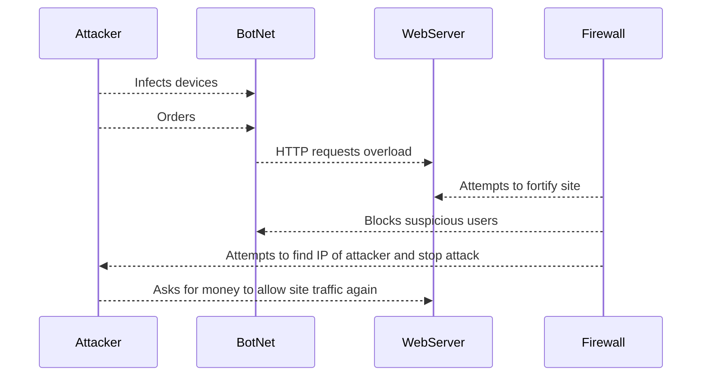

# DDoS Attack Diagram

## Documentation
In a Distributed Denial of Service attack, an attakcer infects many different computers with different locations, creating a botnet. This botnet is then commanded by the attacker to spam requesyts to one site, overloading it and shutitng it down to legitiamate users. They can also do this with invalid IP/DHCP requests. Once the site is overloaded there is little the firewall can do, as blocking one user won't stop the other ones from continuing to spam the site, and the botnet can accumulate more computers as it runs. In some cases, the attack is used as revenge or activism, and in some, money is requested from the site for the DDoS attack to end.