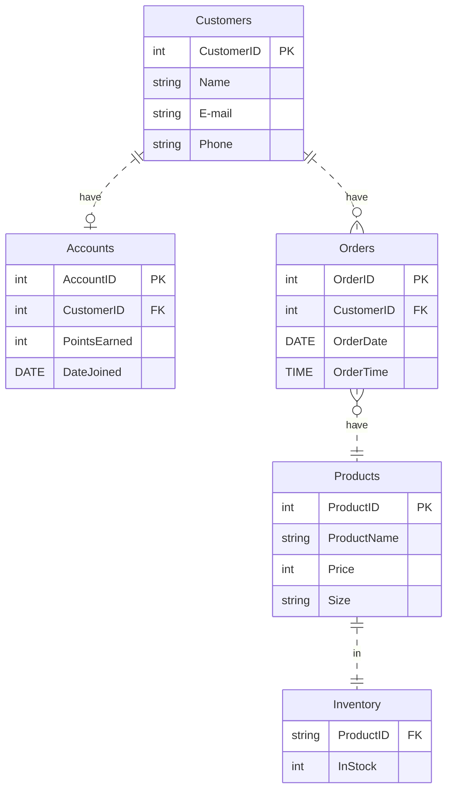

# NIKE Store

## Documentation
A customer is added to the database when either an account is created, or an order is placed. This is why some customers have zero orders.

### Relationships:

* Customers can have one or no account.
* Customers can have any zero or many orders.
* Orders belong to one customer.
* Accounts belong to one customer.
* Orders are for one product
* Products can belong to many or no orders.
* Each Product has one entry in the inventory database.
* Each entry in the inventory database correlates to one entry in the products database.

### Orders:
For this nike store, one "order" is the purchasing of a single product. for example, if someone buys two pairs of shoes (even if they are the same pair) then they placed two orders in the database.

