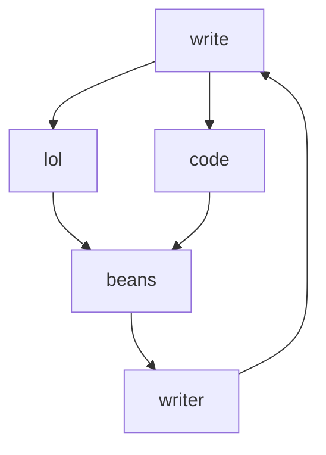
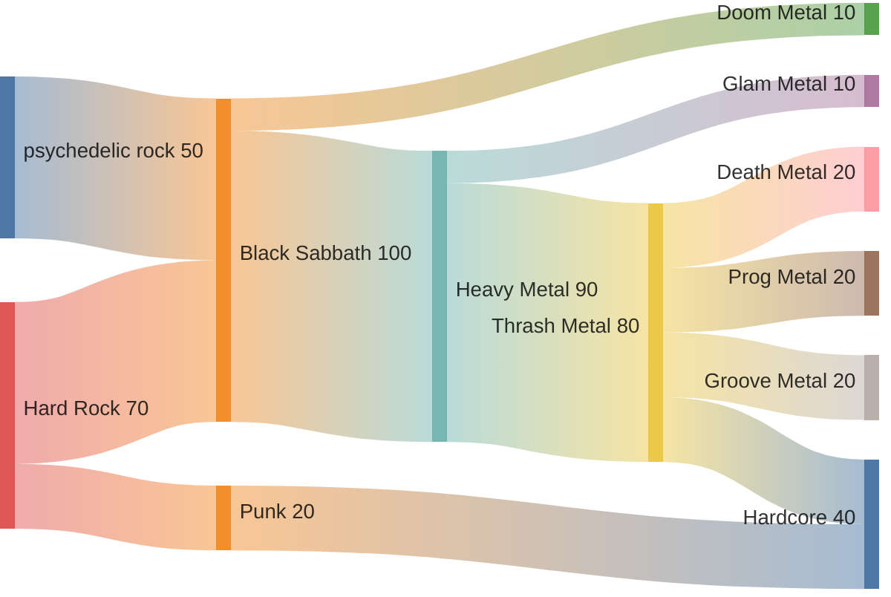

# About Me
## My Interests
I enjoy playing bass, piano, and keyboard
I have played piano for **8** years, and Bass for **11** months. 
I play pickleball and basketball with my brother often. 
I love to code, and use godot.
I am a member of _NHS_, _NTHS_, _Ready Set App_, and _Speech and Debate_. 
I also enjoy playing chess.
### Favorite music genres
* heavy metal
* Thrash metal
* ~~Rock~~
* Psychedelic Rock
* Progressive Rock
### Favortie musical artists
1. Led Zeppelin
2. Voivod
3. Kansas
4. Yes
5. Judas Priest
6. The Beatles
7. Bob Marley
8. Anthrax
9. Black Sabbath
10. TOTO

### Favorite games and If I've beaten them yet
- [x] Hollow Knight
- [x] Breath of the Wild
- [x] Axiom Verge
- [x] Celeste
- [x] Terraria
- [ ] Elden Ring
- [ ] For Honor
- [ ] Stardew Valley
- [ ] Dead Cells
- [ ] Tears of the Kingdom

### Websites I could not survive without
1. [Terraria Wiki](https://terraria.wiki.gg/wiki/Terraria_Wiki)  
- I used to play this game with my brother, way before we knew youtube existed, and without this wiki we would have been completely lost. Every time we come back to this game we need this wiki to help us desperately.
2. [Hollow Knight Wiki](https://hollowknight.wiki/w/Hollow_Knight_Wiki)  
- I have beaten this game many times, and have 111% completion over the course of playing it on and off for three years. Without this wiki, I would have been completely lost. 
3. [Youtube](https://www.youtube.com/)  
- I need this site not only for entertainment, but for helping me with schoolwork, finding bass tabs, and listening to music. This site is "interesting" because it gives you 30 second unskippable ads. This is an edit because my vscode was bugging out and i needed to git add again.
## My Mermaid charts

### Somewhat Comprehensive Metal Music diagram

